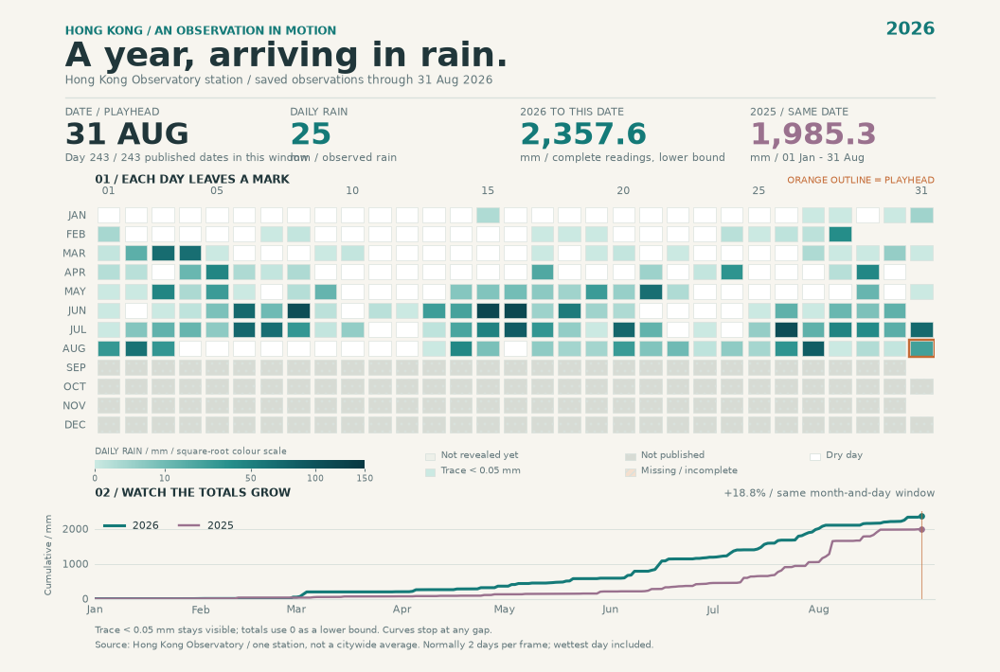

# A year, in rain

An **animated GIF and interactive explorer** of daily rainfall at the Hong Kong
Observatory, with **2026** as the main subject and **2025** as a comparison.
Rainfall changes both the feel of the city and the rhythm of an ordinary day.
Watch small wet days and larger bursts build a year's total, then change the
view and inspect the individual days behind the pattern.

`rainfall_main.py` is the main entry point. It uses `number.py` to read and
validate the saved observations, then combines the animation and browser
explorer into one project. The other scripts can also be run separately for
data inspection, animation export, or a quick visit to the interactive page.




The animation is the portable preview. Run the project to open the interactive
version, where the same data can be explored in four visual modes. The original
[full-page still](out/rainfall-2026.png) and [vector version](out/rainfall-2026.svg)
are also included for reading or printing.

## Run and explore

```bash
uv run rainfall_main.py
```

This builds the GIF and stills, generates `site/index.html`, and opens the explorer
in a browser. Keep the terminal open while using the local viewer; press **Ctrl+C**
when finished. Startup saves recent official reports and current weather before
building the page. The browser then requests updates every **15 minutes**; use
**Refresh weather** to request them sooner. The page also embeds the saved observations
and assets, so it remains readable without a server or internet connection.

- Switch between **Calendar**, **Daily bars**, **Rain wheel**, and **Cumulative**
  to see the same numbers encoded as colour, height, radius, or accumulated rain.
- Choose **2026** or **2025**, play or pause, change speed, and drag the day slider.
  Seeking backwards also moves the totals and visible observations backwards.
- Hover, focus, or select a day to inspect its date, rain amount, quality status,
  and cumulative amount. A selected detail stays available while you examine it.
- Keep **same-period comparison** enabled to compare equal month-and-day windows.
  Disable it to explore the full 2025 calendar on its own. The unfinished 2026
  record is never compared with an entire 2025 total.

The scripts use their own dependency blocks. After uv has installed or cached
Python and the declared plotting dependencies, **`--offline`** uses only checked
local sources and disables automatic browser requests. A verified GIF is reused when its source data and animation
code are unchanged, so opening the project again does not render every frame.

For a quick visit without exporting the animation again:

```bash
uv run explore.py
```

For headless generation, such as on a build machine:

```bash
uv run rainfall_main.py --export --offline
```

## Recent reports and live updates

The monthly climate CSV currently ends on **31 August 2026**. That is a publishing
boundary, not a hard-coded calendar limit. The explorer now adds the Observatory's
[dated Daily Weather Summary (RYES)](https://data.gov.hk/en-data/dataset/hk-hko-rss-weather-and-radiation-level-report/resource/9551ffed-5ce2-469f-b9e6-38a938febee9)
for finished days, and its [current weather report](https://data.weather.gov.hk/weatherAPI/opendata/weather.php?dataType=rhrread&lang=en)
and [past-hour automatic-station rainfall](https://data.weather.gov.hk/weatherAPI/opendata/hourlyRainfall.php?lang=en)
for the ongoing day. These are observations, not forecasts.

The initial recent cache contains **1 September-1 October 2026**: 31 daily
reports adding **94.3 mm** to the verified monthly **2,357.6 mm**, giving a
**2,451.9 mm lower bound through 1 October**. This agrees with the Observatory's
annual accumulated rain in the 1 October report. The calendar and playback can
reach **2 October**, while today's unfinished daily total stays blank and out of
annual totals, rain-day counts, peak-day selection and matched-year comparison.
Recent reports are **provisional**, with only limited validation; their values
and counts are distinguished from verified monthly climate records.

Today's weather sheet separately displays current temperature, current humidity,
and rain over an explicitly timed **rolling one-hour interval** at the Observatory
station **RF023**. Each reading has its own observation time. A recent hour with
zero rain does not establish a dry day. Daily mean humidity and cloud cover stay
unavailable until the publisher supplies them; daily minimum/maximum humidity is
not averaged to invent a daily mean. RYES is normally published after midnight
for the previous day, so a complete 2 October total cannot appear before that day
ends and the report is released.

Startup updates missing dated reports, revisits the latest seven provisional
days, and requests current weather. Raw JSON responses are saved unchanged under
`data/live/raw/`; `data/live/manifest.json` retains versions, URLs, reception times,
lengths and SHA-256 checksums. A failed request keeps the last valid response and
shows a warning with its age. The live sources have different sampling intervals;
**15-minute polling is not a promise of second-by-second measurements**.

Browser requests update the displayed page in memory. Re-running the Python entry
point saves fresh raw evidence to disk. **Offline mode** stops automatic browser
polling; it can be changed in the page. A file opened without a connection uses
its embedded snapshot. These commands provide explicit cached operation:

```bash
uv run rainfall_main.py --offline
uv run explore.py --offline
uv run explore.py --build-only --offline
uv run live.py --offline
uv run test_live.py
```

To update the raw live cache without opening the viewer, use `uv run live.py`.
The exported GIF and PNG/SVG stills continue to use the verified monthly snapshot,
so their August endpoint differs from the explorer's more recent provisional
record. Their dates and provenance remain visible.

## Look inside a day

Click a **Calendar** square, or focus it and press **Enter** or **Space**, to
open **Day weather**. The sheet shows the saved daily rain, maximum and minimum
temperature, mean relative humidity, and mean cloud amount for that date.
Use the previous/next controls to change dates; close the sheet or press
**Escape** to return to the calendar. Opening it pauses yearly playback, while
the yearly cursor stays where it was.

The four extra daily elements are official Hong Kong Observatory observations.
Eight original CSV responses are saved unchanged in `data/weather/`: four for
2025 and four for 2026. They cover all **365 days of 2025** and **243 days of
2026, 1 January through 31 August**. `manifest.json` records each source URL,
download time, coverage, units, response size, and SHA-256 checksum. Each value
retains its own completeness flag; an absent temperature or cloud observation
does not erase the other observations on that day.

For example, **15 June 2026** has **122.6 mm** of official daily rain, a maximum
temperature of **29.9 degrees Celsius**, a minimum of **25.2 degrees Celsius**,
mean humidity of **91%**, and mean cloud amount of **96%**. Humidity and cloud
are daily means, rather than a description of every hour. Recent RYES reports
add maximum/minimum temperatures, but do not provide these daily means.

The hourly area reserves 24 one-hour slots, with exact-value inspection,
play/pause, a speed control, and a slider. Real cached automatic-station
observations can fill these slots; measured zero and missing hours remain
separate. The historical snapshot has **no precise station hourly observations**:
the official archive query did not supply the requested historical feed. Live
responses may gradually add real whole-hour observations to the cache; updates
ending on a quarter-hour are shown only as rolling current readings.
Dates without any saved whole-hour observations show missing slots and disabled
playback; future intervals on the ongoing day are separately marked pending. This means the project
has not obtained the records, not that the Observatory has no records.

Hourly observations are provisional AWS data, a different source from the
official daily climate record. Only non-overlapping whole-hour windows are
used: the day's 00-01 interval ends at 01:00, and 23-24 ends at next-day 00:00,
all in Hong Kong time (UTC+08:00). Quarter-hour updates must not be added
together, and the daily rain is never divided into made-up hourly amounts.

To inspect the existing weather cache without requesting anything:

```bash
uv run weather.py
uv run test_weather.py
```

For initial weather download, or to request a selected historical hourly day:

```bash
uv run fetch_weather.py
uv run fetch_weather.py --hourly-only --hourly-date 2026-06-15
```

Existing raw files are checksum-verified and kept. Hourly downloads are optional
and may be unavailable for the requested date; their query status is recorded
separately. An existing proxy can be passed explicitly with `--proxy URL`; no
local port is built into the code. On Windows the downloader uses TLS 1.2 with
normal certificate validation. The historical download helper remains optional;
recent automatic updates use the separate `live.py` layer.

## Scripts and outputs

Run these commands from the project folder. For normal use, start with
`uv run rainfall_main.py`; running every helper script separately is unnecessary.

| Script | Command | Purpose and output |
|---|---|---|
| `rainfall_main.py` | `uv run rainfall_main.py` | Update the live cache, build the PNG/SVG stills, generate or reuse a verified GIF, and open the interactive explorer. Add `--offline` for cached operation. |
| `explore.py` | `uv run explore.py` | Update recent observations and open the interactive page without exporting images or a GIF. Add `--offline` for cached operation. |
| `animate.py` | `uv run animate.py` | Export `out/rainfall-2026.gif` and `out/rainfall-animation-preview.png`. |
| `number.py` | `uv run number.py` | Verify the raw snapshot and print date coverage, rainfall totals, rainy-day counts, Trace counts, and peak days. This module also supplies the shared data functions. |
| `fetch.py` | `uv run fetch.py` | Download the raw snapshot if it is absent; otherwise check its checksum without requesting or replacing it. |
| `test_rainfall.py` | `uv run test_rainfall.py` | Run the focused checks for parsing, data quality, comparison windows, and playback statistics. |
| `weather.py` | `uv run weather.py` | Verify cached daily weather and report hourly availability without networking. |
| `fetch_weather.py` | `uv run fetch_weather.py` | Save missing official weather responses with provenance; optionally request selected historical hourly dates. |
| `live.py` | `uv run live.py` | Save recent dated reports and current observations as immutable raw versions. Use `--offline` to inspect the cache. |
| `test_live.py` | `uv run test_live.py` | Verify provisional values, observation intervals, cache integrity, failed-request fallback and the current-day boundary without networking. |
| `test_weather.py` | `uv run test_weather.py` | Check weather quality, date joins, checksums, and hourly time-window semantics. |
| `check.py` | `uv run check.py --assignment 2` | Run the course's assignment-2 checklist for documentation, scripts, data, pictures, and Git history. |

For animation export alone:

```bash
uv run animate.py
```

This command exports files; it does not open an animation window. Rendering may
take a few minutes. The terminal prints `Rendering ...` at the start and `wrote` messages for the
saved outputs at the end. Keep the command running until it finishes. Open
the resulting GIF to view the animation.
Unlike the main entry point, this standalone command renders the GIF on every
run instead of checking the main entry point's animation cache.

For an interactive page without opening a browser or starting a server:

```bash
uv run explore.py --build-only --offline
```

The generated `site/index.html` embeds its checked data, styles, and JavaScript.
It can be opened directly in a browser. Editable viewer assets remain in
`assets/`, raw observations and provenance in `data/`, and exported pictures
and the GIF in `out/`.

## The numbers

The source is the Hong Kong Observatory's [daily total rainfall dataset](https://data.gov.hk/en-data/dataset/hk-hko-rss-daily-total-rainfall).
The [original CSV endpoint](https://data.weather.gov.hk/weatherAPI/cis/csvfile/HKO/ALL/daily_HKO_RF_ALL.csv)
is saved unchanged as `data/daily_HKO_RF_ALL.csv`. The separate `data/source.json`
records the download time, source URL, response size, and SHA-256 checksum.
The raw CSV is also excluded from Git's line-ending conversion in `.gitattributes`.

The file contains **49,492 published daily rows**, spanning March 1884 to August
2026. Each row gives a year, month, day, rainfall amount in **millimetres**, and
the publisher's data-completeness flag. One historical row is an unavailable
placeholder for the nonexistent date **1900-02-29**. It remains in the raw file;
the parser explicitly reports its exclusion, leaving 49,491 valid dated records.
The two title lines, column headings, and explanatory footnotes are also preserved.

This snapshot has **365 complete records for 2025**, and **243 complete records for
2026, from 1 January through 31 August**. There are no missing or incomplete days
in either January-August comparison window. Publication is monthly: the absence
of September-December 2026 in this snapshot does not mean those months were dry.

## Reading the views

Every calendar square is one valid day. The animation progressively reveals
published readings, moves a date cursor, and grows both cumulative lines in sync.
The explorer keeps measured zero, trace rain, missing or incomplete readings,
unpublished dates, and observations not yet revealed by playback distinct.
The shared colour scale expands small rain amounts with a square-root mapping;
the labels remain in millimetres. The wettest observed day in 2026 is **15 June,
with 122.6 mm**.

The rain wheel places the day of the year around a circle, with the rainfall
amount controlling radius. It is a seasonal view inspired by the course's
`tide_clock.py`, not a map. Bars make individual rain events easier to compare;
the cumulative view shows how those events add up. Switching modes keeps the
playback date and revealed numbers. Cumulative inspection stays within the
published exploration window. The wheel's small status dots do not encode rain
amounts; bars use a one-pixel visibility floor for tiny readings and zero.

The exported GIF and still cumulative lines compare **1 January-31 August in both years**.
The interactive explorer can extend this comparison through available finished
recent days; its labels distinguish provisional and verified values. Recorded rain
over that window is **2,357.6 mm in 2026** and **1,985.3 mm in 2025**, about **18.8%
more in 2026**. A rainy day here means at least 1 mm: 85 such days in 2026, compared
with 73 in the same 2025 window. These are two years of observations, not evidence
of a long-term climate trend.

The picture hides variation within each day and across Hong Kong: this is one
station, not a citywide average. The publisher's `Trace` means less than 0.05 mm.
Traces are pale marks in the calendar and contribute zero as a **lower bound** to
totals, not as a claim that no rain fell. There are 30 trace readings in the 2026
window and 36 in the 2025 window, so the uncounted trace amounts are less than
1.5 mm and 1.8 mm respectively. Missing or incomplete records never enter totals;
a cumulative line stops at the first such gap rather than silently bridging it.

## Inspect or fetch

```bash
uv run number.py
uv run test_rainfall.py
uv run fetch.py
```

The first two commands audit the numbers and run focused data-handling checks.
The fetch script is optional when the snapshot is present: it verifies the
existing checksum and makes no request. It never replaces a saved CSV.

## Optional web publication

Editable HTML, CSS, and JavaScript live in `assets/`; `explore.py` embeds them
and the checked data into the self-contained generated page. `site/` is ignored.
The supplied `.github/workflows/pages.yml`, adapted from the course workflow,
builds the page with `uv run explore.py --build-only` on GitHub. To publish later,
commit and push the project, then select **GitHub Actions** under the repository's
Pages settings. No live page is claimed until that deployment actually succeeds.

## Assignment status

The project includes the raw snapshot, animated and interactive views, still
previews, and the course workflows. Before submitting, include an honest
`PROCESS.md` describing the actual tools and AI assistance, one choice kept,
and one choice rejected. Keep this required note at the project root and commit it with the work.

Commit and push the source files, raw data, exported pictures, and documentation,
including the updated filenames and imports. The assignment requires a public
repository and at least three genuine commits across at least two days.
That history must come from actual work, not fabricated timestamps. Run
`uv run check.py --assignment 2` to inspect the local checklist before submission.
A passing checklist verifies structure; it does not judge the design or replace
an author's review of the work.
