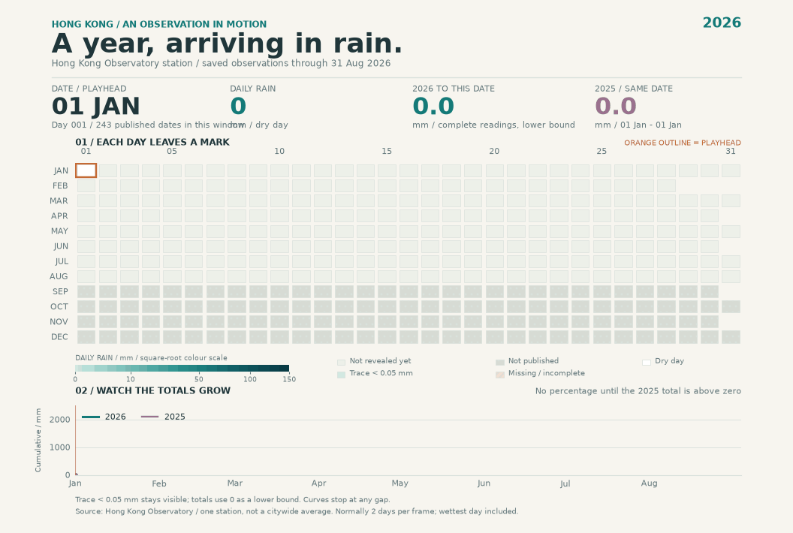

# Rainfall in HK 2025/2026.

A little record of Hong Kong’s wet and dry days. Follow **2026**, compare
it with **2025**, and pause on any day that catches your eye.



Still previews: [PNG](out/rainfall-2026.png) ·
[SVG](out/rainfall-2026.svg) ·
[Animation frame](out/rainfall-animation-preview.png)

## Get started

Run this from the project folder with **uv** installed:

```bash
uv run rainfall_main.py
```

This updates recent weather, creates or reuses the GIF, saves the previews,
and opens the explorer. Keep the terminal open; **Ctrl+C** stops the server.

The first run may need internet access for Python and dependencies.

| What you want | Command |
|---|---|
| Open the explorer without exporting images | `uv run explore.py` |
| Export everything without opening a browser | `uv run rainfall_main.py --export` |
| Open using saved weather | `uv run rainfall_main.py --offline` |
| Export using saved weather | `uv run rainfall_main.py --export --offline` |
| Build a cached web page | `uv run explore.py --build-only --offline` |
| Render the GIF again | `uv run animate.py` |
| Update the live cache only | `uv run live.py` |

**Parameters**

- `--export`: save outputs without opening the viewer.
- `--build-only`: generate `site/index.html` without starting the viewer.
- `--offline`: use saved weather and start the page with refresh disabled.

`--export` and `--build-only` still update weather unless `--offline` is added.
To also stop uv from downloading dependencies, use the following command
with Python and dependencies already cached:

```bash
uv run --offline rainfall_main.py --offline
```

## Have a look around

- Try **Calendar**, **Daily bars**, **Rain wheel**, or **Cumulative**.
- Choose a year, press **Play**, change speed, or drag the date slider.
- Hover or focus a day for a quick reading.
- Click a Calendar square—or press **Enter / Space**—for **Day weather**.
- Use previous/next to browse dates; **Escape** closes the weather panel.
- **Same-period comparison** matches completed dates in both years.

The daily panel shows available rain, maximum/minimum temperature,
mean humidity, and mean cloud cover. Missing values stay blank.

The **Current weather** section keeps today’s temperature, humidity,
and rolling one-hour rain separate, each with its own observation time.

### Inside the day

The hourly chart has 24 slots, a slider, playback, and speed controls.
**Play hours** becomes available when at least one genuine reading exists.
**Browse saved hourly dates** helps you find dates with hourly records.

Only observations ending exactly on a whole hour fill these slots.
Measured zero, missing records, and unfinished intervals remain distinct.
A full 24-hour record is not guaranteed.

## Live updates and offline use

The viewing date follows **Hong Kong time (UTC+08:00)** within the
configured years. Complete daily totals require an ended day and a
published report; today stays out of completed-day statistics.

- The visible page checks official sources about every **15 minutes**.
- **Refresh weather** requests an update sooner.
- **Offline snapshot** stops requests; unchecking it refreshes immediately.
- Failed requests keep available readings and show a warning.

Browser updates stay **in memory**. Reloading or closing the page loses
those updates. Run `rainfall_main.py` or `explore.py` again to save fresh
responses and rebuild the page.

`live.py` saves the raw cache but does not rebuild HTML. The generated
`site/index.html` can also be opened directly using its embedded snapshot.

## About the numbers

Observations come from the **Hong Kong Observatory station**, not a
citywide average. Daily rain is measured in **millimetres**.

Sources: [Daily rainfall](https://data.gov.hk/en-data/dataset/hk-hko-rss-daily-total-rainfall) ·
[Daily weather reports](https://data.gov.hk/en-data/dataset/hk-hko-rss-weather-and-radiation-level-report/resource/9551ffed-5ce2-469f-b9e6-38a938febee9) ·
[Current weather](https://data.weather.gov.hk/weatherAPI/opendata/weather.php?dataType=rhrread&lang=en) ·
[Past-hour rainfall](https://data.weather.gov.hk/weatherAPI/opendata/hourlyRainfall.php?lang=en)

- **Verified snapshot:** January–August 2026, 243 complete days,
  **2,357.6 mm**. The GIF and stills use this snapshot.
- **Recent reports:** provisional daily readings extend the explorer.
- **Rainy day:** at least **1 mm**.
- **Trace:** below **0.05 mm**, counted as zero only as a lower bound.
- **Missing / incomplete:** excluded from totals; cumulative lines stop at gaps.

Mean humidity and cloud cover are daily values. Current readings do not
replace them, and overlapping rolling-hour rain is never added together
or used to invent a daily total.

Raw responses are preserved unchanged. Their manifests record source URLs,
download times, and **SHA-256** checksums.

## Files and helpers

| Location | Contents |
|---|---|
| `data/` | Original rainfall, weather, live responses, and provenance |
| `assets/` | Editable viewer HTML, CSS, and JavaScript |
| `out/` | GIF and PNG/SVG previews |
| `site/index.html` | Generated, self-contained explorer |

For a closer look at the saved data:

```bash
uv run number.py
uv run weather.py
uv run live.py --offline
```